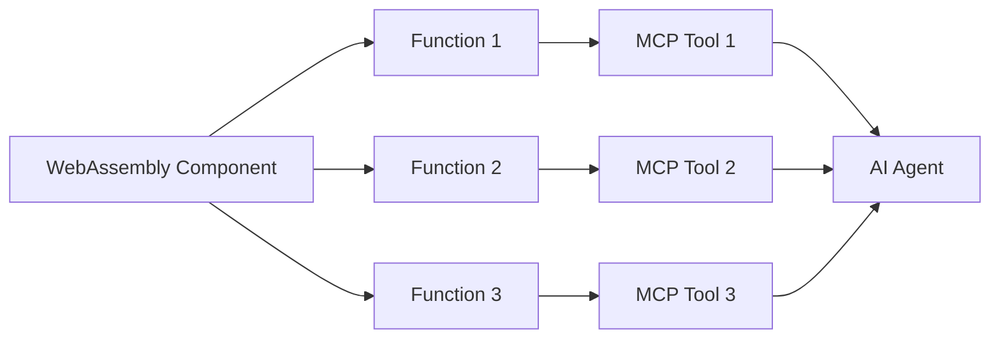
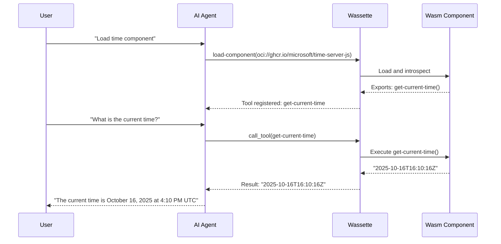

# Core Concepts

This page introduces the fundamental concepts behind Wassette and how it bridges the Model Context Protocol (MCP) with WebAssembly Components.

## Model Context Protocol (MCP)

The [Model Context Protocol](https://modelcontextprotocol.io/docs/getting-started/intro) is a standard protocol that defines how AI agents (like Claude, GitHub Copilot, or Cursor) communicate with external tools and services.

### MCP Components

MCP defines several types of components that servers can provide: **tools** (functions that AI agents call to perform actions), **prompts** (reusable conversation templates), and **resources** (data sources like files or API endpoints). Wassette is an MCP server that primarily focuses on tools, translating WebAssembly component functions into MCP tools that AI agents can invoke. Prompts and resources are not currently supported.

## WebAssembly Component Model

WebAssembly (Wasm) is a portable binary instruction format that runs in a sandboxed environment. The **WebAssembly Component Model** extends basic Wasm with standardized interfaces for building composable, reusable components. For a deeper understanding, see [WebAssembly Components: The Next Wave of Cloud Native Computing](https://www.cncf.io/blog/2024/07/09/webassembly-components-the-next-wave-of-cloud-native-computing/).

### Key Concepts

#### Components

A **component** is a self-contained WebAssembly module with a well-defined interface. Components are portable, language-agnostic libraries that run securely anywhere with a Wasm runtime.

#### WIT (WebAssembly Interface Types)

**WIT** is an Interface Definition Language (IDL) that describes how components interact with each other and with the host environment.

Example WIT interface:
```wit
package example:weather;

interface weather-api {
    /// Get current weather for a location
    get-weather: func(location: string) -> result<string, string>;
}

world weather-component {
    export weather-api;
}
```

This defines:
- A `package` namespace for the component
- An `interface` with functions and their types
- A `world` that declares what the component exports

#### Bindings

**Bindings** are the language-specific code that connects your source code to the WIT interface. The WebAssembly tooling automatically generates these bindings, so you can write code in your preferred language while maintaining the standard Wasm interface.

For example:
- In JavaScript: Use `jco` to generate TypeScript bindings
- In Python: Use `componentize-py` to generate Python bindings
- In Rust: Use `wit-bindgen` to generate Rust bindings

## How Wassette Translates Components to MCP Tools

Wassette acts as a bridge between WebAssembly Components and the Model Context Protocol. Here's how it works:

### One Component, Multiple Tools

Each WebAssembly component can export multiple functions, and Wassette translates each exported function into an individual MCP tool. This is different from traditional MCP servers where one server typically provides a fixed set of tools.



### Dynamic Tool Registration

When you load a component in Wassette, the system first loads the WebAssembly component using the Wasmtime runtime, then examines the component's WIT interface to discover exported functions. Each function's parameters and return types are converted to JSON Schema, and each function becomes an MCP tool with a name, description, and parameter schema. When an AI agent calls a tool, Wassette executes the corresponding function in the sandboxed Wasm environment.

### Stateful vs Stateless Components

By default, Wassette creates a fresh WebAssembly Store and Instance for each tool call. This **stateless mode** ensures complete isolation between calls but means components cannot maintain in-memory state.

For components that need to preserve state across calls (caches, counters, open file handles, database connections), Wassette supports **stateful mode**:

```rust
// Load a component in stateful mode
manager.load_component_with_options(
    "oci://example/memory-component",
    LoadOptions { stateful: true }
).await?;
```

**Key characteristics of stateful mode:**

- **Persistent Store/Instance**: The WebAssembly Store and Instance persist across tool calls
- **In-memory state**: Component globals, heap allocations, and static data survive between calls
- **Resource continuity**: WASI resources (file handles, sockets) remain valid across calls
- **Serialized execution**: Concurrent calls to the same stateful component are queued to prevent race conditions
- **Process-scoped lifetime**: State persists until the component is unloaded or the process exits

**When to use stateful mode:**

- Knowledge graph or memory components that accumulate data
- Components with expensive initialization (loading models, parsing configs)
- Components managing persistent connections or sessions
- Caching layers that benefit from warm state

**When to use stateless mode (default):**

- Stateless utility functions (formatting, calculations)
- Components where isolation between calls is important
- When you want predictable, reproducible behavior

### Example Flow



### Function Naming

Wassette converts WIT interface names into tool names by replacing colons and slashes with underscores. For example:
- WIT: `example:weather/weather-api#get-weather`
- Tool name: `example_weather_weather_api_get_weather`

## Policy and Capability Model

Wassette's security model is built on the principle of **least privilege**: components have no access to system resources by default and must be explicitly granted permissions.

### Capability-Based Security

Wassette enforces a deny-by-default security model. Consider a weather component that needs to access an API:

```yaml
# Without permissions - component cannot access anything
storage: {}
network: {}
environment: {}
```

```yaml
# With permissions - component can access specific resources
storage:
  allow:
    - uri: "fs:///tmp/cache"
      access: ["read", "write"]
network:
  allow:
    - host: "api.weather.com"
environment:
  allow:
    - key: "API_KEY"
```

This capability-based model ensures components only access resources you explicitly grant, with the Wasm sandbox enforcing all policies at runtime.

### Permission Types

#### File System Permissions

Control read and write access to files and directories:

```yaml
storage:
  allow:
    - uri: "fs:///workspace/data"
      access: ["read", "write"]
    - uri: "fs:///etc/config.yaml"
      access: ["read"]
```

#### Network Permissions

Control outbound network access to specific hosts:

```yaml
network:
  allow:
    - host: "api.weather.com"
    - host: "api.openai.com"
```

#### Environment Variable Permissions

Control access to environment variables:

```yaml
environment:
  allow:
    - key: "API_KEY"
    - key: "HOME"
```

#### Resource Limits (Future)

Future versions will support resource limits such as:
- Maximum memory allocation
- CPU time limits
- Maximum execution time

### Permission Management

Permissions can be managed in several ways:

1. **Policy Files**: YAML files that define component permissions
2. **Built-in Tools**: MCP tools like `grant-storage-permission` and `grant-network-permission`
3. **CLI Commands**: Direct management via `wassette permission grant` commands
4. **AI Agent Requests**: Natural language requests to your agent (e.g., "Grant this component read access to the workspace")

For detailed information on working with permissions, see the [Managing Permissions](./reference/permissions.md) guide.

### Security Boundaries

Wassette provides multiple layers of security:

```
┌─────────────────────────────────────┐
│         Host System                 │
│  ┌───────────────────────────────┐  │
│  │   Wassette MCP Server         │  │
│  │  ┌─────────────────────────┐  │  │
│  │  │  Wasmtime Runtime       │  │  │
│  │  │  ┌───────────────────┐  │  │  │
│  │  │  │ Wasm Component    │  │  │  │
│  │  │  │ (Sandboxed)       │  │  │  │
│  │  │  └───────────────────┘  │  │  │
│  │  │  Policy Engine          │  │  │
│  │  └─────────────────────────┘  │  │
│  └───────────────────────────────┘  │
└─────────────────────────────────────┘
```

1. **Wasm Sandbox**: Memory isolation, type safety, no direct system access
2. **Wasmtime Runtime**: Enforces WASI (WebAssembly System Interface) capabilities
3. **Policy Engine**: Applies fine-grained permission checks
4. **Wassette Server**: Manages component lifecycle and MCP protocol

## Next Steps

Now that you understand the core concepts behind Wassette:

- **[Installation](./installation.md)**: Install Wassette on your system
- **[MCP Clients](./mcp-clients.md)**: Set up Wassette with your AI agent
- **[Managing Permissions](./reference/permissions.md)**: Learn how to grant and revoke permissions
- **[Building Components](./cookbook/README.md)**: Create your own WebAssembly components
- **[Architecture](./design/architecture.md)**: Dive deeper into Wassette's technical design

## Additional Resources

- [Model Context Protocol Specification](https://spec.modelcontextprotocol.io/)
- [WebAssembly Component Model](https://component-model.bytecodealliance.org/)
- [WIT Specification](https://github.com/WebAssembly/component-model/blob/main/design/mvp/WIT.md)
- [WASI Preview 2](https://github.com/WebAssembly/WASI)
- [Wasmtime Security](https://docs.wasmtime.dev/security.html)
